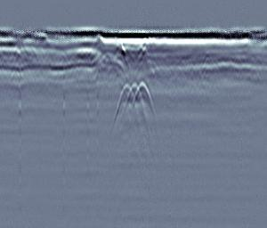
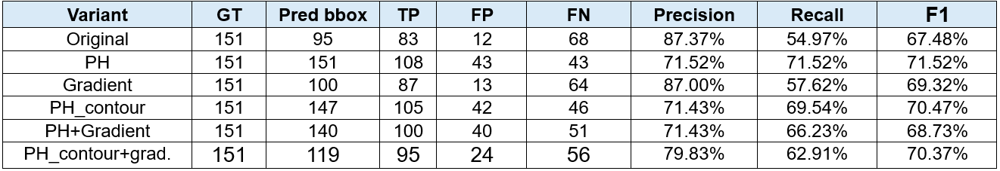
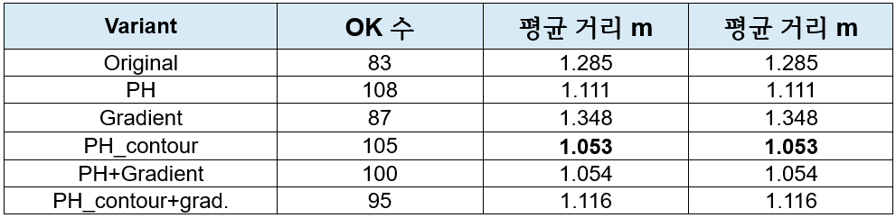
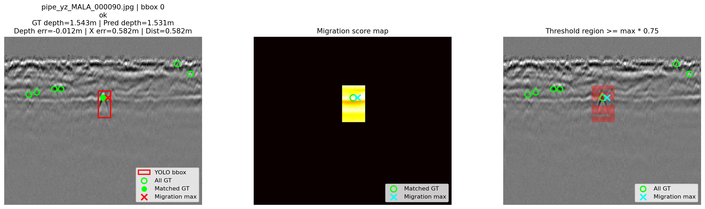

# 26-1-Software-Capstone-Design
# Persistent Homology 기반 GPR 영상 내 매설물 탐지

## 1. Project Overview

본 프로젝트는 **GPR(Ground Penetrating Radar) B-scan 영상**에서 지하 매설물로 의심되는 쌍곡선 구조를 탐지하고, 검출된 ROI 내부에서 **migration 기반 위치 추정**을 수행하는 파이프라인을 구현한 것이다.

GPR B-scan 영상에서 관형 매설물은 일반적으로 아래와 같은 **hyperbola 형태의 반사 패턴**으로 나타난다.



하지만 실제 GPR 영상에는 수평 배경 잡음, 지층 변화, 작은 반사체, 약한 신호, void와 같은 구조가 함께 포함되어 있어 단순한 원본 이미지 기반 detector만으로는 안정적인 탐지가 어렵다.

이를 해결하기 위해 본 프로젝트에서는 다음 세 가지 접근을 결합하였다.

1. GPR 전처리를 통해 배경 잡음과 저주파 성분을 제거하고 쌍곡선 구조를 강조
2. Persistent Homology 기반 TDA feature와 y-gradient feature를 생성하여 YOLO 입력 채널로 사용
3. YOLO가 검출한 bbox 내부에서 migration score map을 계산하여 매설물 예상 위치를 추정

---

## 2. Main Pipeline

전체 파이프라인은 다음과 같다.

```text
Raw GPR image
    ↓
Preprocessing
    ↓
Feature image generation
    ├── Original
    ├── PH
    ├── PH contour
    ├── Gradient
    ├── PH + Gradient
    └── PH contour + Gradient
    ↓
YOLO detector training
    ↓
ROI bbox prediction
    ↓
Migration inside predicted bbox
    ↓
GT keypoint comparison
    ↓
Detection / localization evaluation
```

---

## 3. Preprocessing

원본 GPR 영상은 쌍곡선 구조가 약하거나 수평 배경 성분이 강하게 나타나는 경우가 많다. 따라서 detector와 TDA feature 생성 전에 다음 전처리 과정을 적용하였다.

| Step | Method                | Purpose                         |
| ---- | --------------------- | ------------------------------- |
| 1    | Background removal    | 수평 방향 배경 성분 제거                  |
| 2    | DEWOW                 | trace별 DC offset 및 저주파 drift 제거 |
| 3    | SEC gain              | 깊이가 깊어질수록 약해지는 반사 신호 보정         |
| 4    | Tapering              | trace 끝부분의 경계 artifact 완화       |
| 5    | Spectral balancing    | 저주파 성분 억제 및 세부 반사 구조 강조         |
| 6    | Bilateral filter      | 경계를 유지하면서 잡음 제거                 |
| 7    | CLAHE                 | 지역 대비 향상                        |
| 8    | Morphological opening | 작은 점 형태의 노이즈 제거                 |

전처리의 목적은 단순히 이미지를 선명하게 만드는 것이 아니라, **GPR 영상에서 쌍곡선 반사 구조가 detector와 TDA feature에 더 잘 반영되도록 만드는 것**이다.

---

## 4. Feature Variants

본 프로젝트에서는 원본 이미지와 전처리 기반 feature를 비교하기 위해 총 6개의 입력 variant를 구성하였다.

| Variant               | R Channel           | G Channel           | B Channel                  |
| --------------------- | ------------------- | ------------------- | -------------------------- |
| Original              | Original image      | Original image      | Original image             |
| PH                    | Bright PH mask      | Dark PH mask        | Preprocessed image         |
| PH contour            | Bright PH contour   | Dark PH contour     | Preprocessed image         |
| Gradient              | Positive y-gradient | Negative y-gradient | Preprocessed image         |
| PH + Gradient         | Bright PH mask      | Dark PH mask        | Preprocessed image + Sobel |
| PH contour + Gradient | Bright PH contour   | Dark PH contour     | Preprocessed image + Sobel |

각 feature variant는 YOLO detector의 입력 이미지로 사용된다.

---

## 5. Persistent Homology Feature

Persistent Homology는 threshold 변화에 따라 생성되고 사라지는 연결 성분의 지속성을 분석하는 TDA 기법이다.

본 프로젝트에서는 GPR grayscale image에 대해 threshold를 변화시키며 connected component를 추출하고, 오래 유지되는 영역에 높은 값을 부여하여 PH mask를 생성하였다.

```text
Grayscale GPR image
    ↓
Threshold filtration
    ↓
Connected component extraction
    ↓
Persistence score accumulation
    ↓
PH saliency map
```

PH feature는 두 가지 방식으로 구성하였다.

* **Bright PH mask**: 밝은 반사 구조 중 오래 유지되는 영역 강조
* **Dark PH mask**: 어두운 구조 중 오래 유지되는 영역 강조
* **PH contour**: PH mask 전체가 아니라 경계선만 남겨 형상 정보 강조

PH mask는 detector가 쌍곡선 주변의 구조적 특징을 더 잘 학습하도록 돕기 위한 입력 feature로 사용하였다.

---

## 6. Gradient Feature

GPR 영상의 쌍곡선 반사 패턴은 y축 방향, 즉 depth 방향에서 밝기 변화가 강하게 나타난다. 따라서 y-direction Sobel filter를 적용하여 수직 방향 gradient feature를 생성하였다.

```text
Preprocessed image
    ↓
Y-direction Sobel filter
    ↓
Positive gradient / Negative gradient separation
    ↓
Gradient feature image
```

Gradient feature는 PH가 넓은 영역을 과도하게 강조하는 문제를 보완하기 위한 비교군으로 사용하였다.

---

## 7. YOLO Detection

각 feature variant별로 YOLO detector를 학습하였다.

| Item              | Value            |
| ----------------- | ---------------- |
| Framework         | Ultralytics YOLO |
| Base model        | YOLOv8n          |
| Image size        | 640              |
| Epochs            | 100              |
| Batch size        | 8                |
| Class             | hyperbola        |
| Train images      | 420              |
| Validation images | 120              |
| Test images       | 60               |

YOLO의 역할은 GPR 영상에서 쌍곡선 후보 영역을 bbox 형태로 검출하는 것이다.

```text
Feature image
    ↓
YOLO detector
    ↓
Predicted hyperbola bbox
```

---

## 8. Migration-based Localization

YOLO bbox는 쌍곡선 후보 영역을 찾지만, 실제 매설물의 위치는 bbox 중심과 일치하지 않을 수 있다. 따라서 bbox 내부에서 migration score map을 계산하여 매설물 예상 위치를 추정하였다.

Migration에서는 bbox 내부의 후보 위치 `(x0, z0)`에 대해 다음과 같은 hyperbola-like curve를 생성하고, 해당 곡선 위의 intensity score를 계산한다.

```text
y(x; x0, z0, alpha) = sqrt(z0^2 + alpha * (x - x0)^2)
```

가장 높은 score를 갖는 위치를 migration max point로 선택하고, 이를 GT keypoint와 비교하였다.

```text
Predicted bbox
    ↓
Candidate hyperbola curve search
    ↓
Migration score map
    ↓
Max score point
    ↓
GT keypoint distance evaluation
```

---

## 9. Dataset and Labeling

라벨링은 두 단계로 구성하였다.

| Label type   | Description               |
| ------------ | ------------------------- |
| Bounding box | 쌍곡선으로 보이는 모든 후보 영역        |
| Keypoint     | bbox 내부에서 매설물 위치로 추정되는 지점 |

Detection 평가는 bbox 기준으로 수행하고, migration 평가는 keypoint 기준으로 수행하였다.

최종 데이터 분할은 다음과 같다.

| Split      | Count |
| ---------- | ----: |
| Train      |   420 |
| Validation |   120 |
| Test       |    60 |
| Total      |   600 |

---

## 10. Detection Results

Detection 성능은 TP, FP, FN, Precision, Recall, F1으로 평가하였다.

| Variant               |  GT | Pred bbox |  TP | FP | FN | Precision | Recall |     F1 |
| --------------------- | --: | --------: | --: | -: | -: | --------: | -----: | -----: |
| Original              | 151 |        95 |  83 | 12 | 68 |    87.37% | 54.97% | 67.48% |
| PH                    | 151 |       151 | 108 | 43 | 43 |    71.52% | 71.52% | 71.52% |
| Gradient              | 151 |       100 |  87 | 13 | 64 |    87.00% | 57.62% | 69.32% |
| PH contour            | 151 |       147 | 105 | 42 | 46 |    71.43% | 69.54% | 70.47% |
| PH + Gradient         | 151 |       140 | 100 | 40 | 51 |    71.43% | 66.23% | 68.73% |
| PH contour + Gradient | 151 |       119 |  95 | 24 | 56 |    79.83% | 62.91% | 70.37% |



### Detection Result Summary

* **PH**는 TP가 108개로 가장 많고 FN이 43개로 가장 적어 recall 중심의 탐지에서 가장 우수하였다.
* **Original**과 **Gradient**는 precision이 높아 잘못된 bbox를 적게 생성하였다.
* 그러나 Original과 Gradient는 FN이 많아 실제 쌍곡선 후보를 놓치는 경우가 상대적으로 많았다.
* **PH contour + Gradient**는 precision과 recall 사이에서 비교적 균형적인 결과를 보였다.

---

## 11. Migration Results

Migration 평가는 `reason == ok`인 경우, 즉 bbox 안에 GT keypoint가 존재하고 migration이 정상 수행된 경우만 사용하였다.

| Variant               | OK count | Mean distance (m) | Median distance (m) | Mean distance (px) | Median distance (px) |
| --------------------- | -------: | ----------------: | ------------------: | -----------------: | -------------------: |
| Original              |       83 |             1.285 |               1.352 |             18.023 |               18.645 |
| PH                    |      108 |             1.111 |               1.168 |             16.995 |               17.586 |
| Gradient              |       87 |             1.348 |               1.393 |             18.976 |               18.892 |
| PH contour            |      105 |             1.053 |               1.163 |             16.243 |               16.266 |
| PH + Gradient         |      100 |             1.054 |               1.166 |             16.736 |               17.159 |
| PH contour + Gradient |       95 |             1.116 |               1.228 |             16.831 |               16.972 |



### Migration Result Summary

* **PH contour**와 **PH + Gradient**가 평균 거리 오차 기준으로 가장 낮은 결과를 보였다.
* Detection 성능이 높은 variant가 항상 migration 위치 추정에서도 좋은 것은 아니었다.
* 이는 GPR 매설물 탐지에서 bbox detection과 keypoint localization을 분리하여 평가해야 함을 보여준다.

---

## 12. Qualitative Result

아래는 YOLO가 검출한 bbox 내부에서 migration을 수행한 결과 예시이다.

```text
Green point: GT keypoint
Red point: Migration max point
Box: YOLO predicted ROI
Dist: Distance between GT and migration point
```



---

## 13. Output Files

실험 결과는 다음과 같은 형태로 저장된다.

```text
Final_Pipeline/
├── yolo_feature_datasets/
│   ├── original/
│   ├── ph2/
│   ├── ph2_contour/
│   ├── sobel2/
│   ├── ph_sobel4_pack3/
│   └── ph_sobel4_contour_pack3/
│
├── runs_gpr/
│   ├── yolo_gpr_original/
│   ├── yolo_gpr_ph2/
│   ├── yolo_gpr_ph2_contour/
│   ├── yolo_gpr_sobel2/
│   ├── yolo_gpr_ph_sobel4_pack3/
│   └── yolo_gpr_ph_sobel4_contour_pack3/
│
├── predictions/
│   └── pred_{variant}_test/
│
├── migration_eval/
│   ├── migration_eval_{variant}.csv
│   ├── migration_eval_all_variants.csv
│   └── migration_eval_summary_by_variant.csv
│
└── migration_results/
    └── {variant}/
```

---

## 14. Evaluation Column Meaning

| Column                    | Meaning                               |
| ------------------------- | ------------------------------------- |
| `variant`                 | 사용한 입력 feature 방식                     |
| `image_name`              | 평가 이미지 이름                             |
| `has_prediction`          | YOLO bbox 예측 여부                       |
| `bbox_has_gt`             | 예측 bbox 내부에 GT keypoint가 있는지 여부       |
| `is_false_detection`      | 잘못된 bbox 예측 여부                        |
| `is_duplicate_detection`  | 같은 GT를 중복으로 탐지했는지 여부                  |
| `is_missed_detection`     | GT가 있지만 어떤 bbox도 포함하지 못한 경우           |
| `reason`                  | 평가 상태                                 |
| `migration_max_x_px`      | migration score 최대점의 x pixel 좌표       |
| `migration_max_y_px`      | migration score 최대점의 y pixel 좌표       |
| `dist_px`                 | GT와 migration point 사이의 pixel 거리      |
| `dist_m`                  | GT와 migration point 사이의 meter 환산 거리   |
| `threshold_region_has_gt` | migration score 상위 영역 안에 GT가 포함되는지 여부 |

---

## 15. How to Run

### 1. Install dependencies

```bash
pip install ultralytics opencv-python numpy pandas matplotlib tqdm
```

TDA 관련 실험을 실행하는 경우 추가 라이브러리가 필요할 수 있다.

```bash
pip install gudhi ripser
```

### 2. Build feature datasets

```python
yaml_paths = build_feature_dataset(
    src_img_dir=SRC_IMG_DIR,
    src_label_dir=SRC_LABEL_DIR,
    dataset_root=FEATURE_DATASET_ROOT,
    variants=VARIANTS,
    train_ratio=0.7,
    val_ratio=0.2,
    max_images=600,
    seed=SEED
)
```

Original baseline은 전처리를 적용하지 않고 원본 이미지를 그대로 복사하여 생성한다.

```python
original_yaml_path = build_original_dataset_by_copy(
    src_img_dir=SRC_IMG_DIR,
    src_label_dir=SRC_LABEL_DIR,
    dataset_root=FEATURE_DATASET_ROOT,
    train_ratio=0.7,
    val_ratio=0.2,
    max_images=600,
    seed=SEED
)
```

### 3. Train YOLO models

```python
trained_models = train_yolo_variants(
    yaml_paths=yaml_paths,
    project_dir=RUNS_DIR,
    base_model="yolov8n.pt",
    epochs=100,
    imgsz=640,
    batch=8
)
```

### 4. Run prediction and migration evaluation

```python
all_eval_dfs = []

for variant, item in trained_models.items():
    pred_results, pred_save_dir = predict_and_save_yolo(
        variant=variant,
        model_path=item["best_weight"],
        dataset_root=FEATURE_DATASET_ROOT,
        save_root=PRED_SAVE_ROOT,
        split="test",
        conf=0.25,
        imgsz=640,
        iou=0.45,
        max_det=50,
        clear_existing=True,
    )

    eval_df = evaluate_variant_predictions(
        variant=variant,
        dataset_root=FEATURE_DATASET_ROOT,
        pred_save_dir=pred_save_dir,
        gt_df=gt_df,
        split="test",
        threshold_ratio=MIGRATION_THRESHOLD_RATIO,
        save_visualization=True,
        one_to_one_gt_matching=True,
    )

    all_eval_dfs.append(eval_df)

all_eval_df = pd.concat(all_eval_dfs, ignore_index=True)
```

### 5. Summarize results

```python
summary_df = summarize_eval(all_eval_df)
summary_df.to_csv("migration_eval_summary_by_variant.csv", index=False)
```

---

## 16. Key Findings

1. **PH feature는 recall 중심의 탐지에 유리하였다.**
   PH는 TP가 가장 많고 FN이 가장 적어 쌍곡선 후보를 최대한 놓치지 않는 데 강점을 보였다.

2. **Original과 Gradient는 precision이 높았다.**
   예측한 bbox 중 잘못된 bbox가 적었지만, 실제 GT를 놓치는 경우가 많았다.

3. **Migration 위치 추정은 PH contour와 PH + Gradient가 우수하였다.**
   bbox가 정상적으로 잡힌 경우, migration point와 GT keypoint 사이의 평균 거리 오차가 가장 낮았다.

4. **Detection 성능과 localization 성능은 다르게 평가해야 한다.**
   bbox를 잘 찾는 모델이 항상 실제 매설물 위치를 가장 정확히 찾는 것은 아니었다.

---

## 17. Limitations

현재 파이프라인에는 다음과 같은 한계가 있다.

* 작은 쌍곡선이나 약한 반사 신호는 detector가 놓치기 쉽다.
* 쌍곡선과 유사한 지층 변화나 주변 반사 구조에서도 false detection이 발생할 수 있다.
* Migration score map은 주변 intensity 변화가 큰 영역에 민감하다.
* 현재는 hyperbola 단일 class만 사용하므로 utility, void, layer change를 구분하지 못한다.
* 실제 깊이 환산에는 GPR 전파 속도와 매질 정보가 필요하지만, 본 실험에서는 이미지 크기 기반 가정값을 사용하였다.

---

## 18. Future Work

향후 연구 방향은 다음과 같다.

* Migration score function 개선
* Segmentation 또는 keypoint detection 모델 적용
* Utility, void, layer change 등 multi-class labeling 도입
* PH mask의 넓은 영역 반응을 줄이기 위한 contour, skeleton, local persistence normalization 적용
* GPR 전파 속도와 매질 정보를 반영한 실제 깊이 calibration 수행

---

## 19. Keywords

`GPR` `Ground Penetrating Radar` `Persistent Homology` `Topological Data Analysis` `YOLO` `Migration` `Underground Utility Detection` `Hyperbola Detection`
